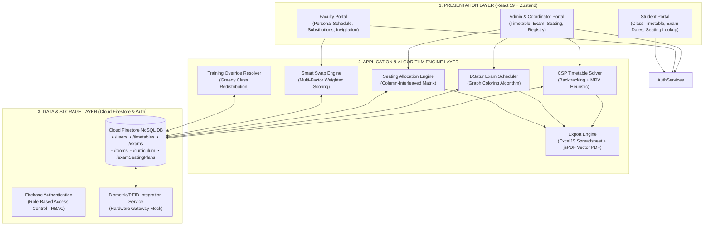

# VIGNANA BHARATHI INSTITUTE OF TECHNOLOGY
**(A UGC Autonomous Institution, Approved by AICTE, Accredited by NBA & NAAC - A Grade, Affiliated to JNTUH)**
### DEPARTMENT OF COMPUTER SCIENCE AND ENGINEERING (Data Science)

---

# DESIGN REVIEW PRESENTATION SLIDES

---

## SLIDE 1: System Architecture (draw.io Ready)

### 1. High-Level Architectural Diagram (Mermaid & draw.io Layout)



---

### draw.io XML Code (Copy & Paste directly into draw.io)
> **How to use in draw.io:** Open [draw.io](https://app.diagrams.net/), click `File` -> `Import from` -> `XML`, paste the XML snippet below:

```xml
<mxfile host="app.diagrams.net">
  <diagram id="VBIT_Architecture" name="System Architecture">
    <mxGraphModel dx="1000" dy="800" grid="1" gridSize="10" guides="1" tooltips="1" connect="1" arrows="1" fold="1" page="1" pageScale="1" pageWidth="1169" pageHeight="827" math="0" shadow="0">
      <root>
        <mxCell id="0" />
        <mxCell id="1" parent="0" />
        
        <!-- Presentation Layer Container -->
        <mxCell id="pres_layer" value="1. PRESENTATION LAYER (React 19 + Zustand UI)" style="swimlane;whiteSpace=wrap;html=1;fillColor=#e1f5fe;strokeColor=#0288d1;fontStyle=1;startSize=30;" vertex="1" parent="1">
          <mxGeometry x="40" y="40" width="1080" height="150" as="geometry" />
        </mxCell>
        <mxCell id="admin_ui" value="Admin &amp; Coordinator Portal&#xa;(Timetable, Exam, Seating, Registry)" style="rounded=1;whiteSpace=wrap;html=1;fillColor=#ffffff;strokeColor=#0288d1;fontStyle=1;" vertex="1" parent="pres_layer">
          <mxGeometry x="40" y="50" width="280" height="70" as="geometry" />
        </mxCell>
        <mxCell id="faculty_ui" value="Faculty Portal&#xa;(Personal Schedule, Substitutions, Duties)" style="rounded=1;whiteSpace=wrap;html=1;fillColor=#ffffff;strokeColor=#0288d1;fontStyle=1;" vertex="1" parent="pres_layer">
          <mxGeometry x="400" y="50" width="280" height="70" as="geometry" />
        </mxCell>
        <mxCell id="student_ui" value="Student Portal&#xa;(Class Schedule, Exam Dates, Seating Lookup)" style="rounded=1;whiteSpace=wrap;html=1;fillColor=#ffffff;strokeColor=#0288d1;fontStyle=1;" vertex="1" parent="pres_layer">
          <mxGeometry x="760" y="50" width="280" height="70" as="geometry" />
        </mxCell>

        <!-- Application / Algorithm Layer Container -->
        <mxCell id="app_layer" value="2. APPLICATION &amp; ALGORITHM ENGINE LAYER" style="swimlane;whiteSpace=wrap;html=1;fillColor=#fff3e0;strokeColor=#f57c00;fontStyle=1;startSize=30;" vertex="1" parent="1">
          <mxGeometry x="40" y="240" width="1080" height="260" as="geometry" />
        </mxCell>
        <mxCell id="csp_engine" value="CSP Timetable Solver&#xa;(Backtracking + MRV Heuristic)" style="rounded=1;whiteSpace=wrap;html=1;fillColor=#ffffff;strokeColor=#ef6c00;fontStyle=1;" vertex="1" parent="app_layer">
          <mxGeometry x="40" y="50" width="240" height="70" as="geometry" />
        </mxCell>
        <mxCell id="dsatur_engine" value="DSatur Exam Scheduler&#xa;(Graph Coloring Algorithm)" style="rounded=1;whiteSpace=wrap;html=1;fillColor=#ffffff;strokeColor=#ef6c00;fontStyle=1;" vertex="1" parent="app_layer">
          <mxGeometry x="320" y="50" width="240" height="70" as="geometry" />
        </mxCell>
        <mxCell id="seating_engine" value="Seating Allocation Engine&#xa;(Column-Interleaved Matrix)" style="rounded=1;whiteSpace=wrap;html=1;fillColor=#ffffff;strokeColor=#ef6c00;fontStyle=1;" vertex="1" parent="app_layer">
          <mxGeometry x="600" y="50" width="240" height="70" as="geometry" />
        </mxCell>
        <mxCell id="swap_engine" value="Smart Swap Engine&#xa;(Multi-Factor Weighted Scoring)" style="rounded=1;whiteSpace=wrap;html=1;fillColor=#ffffff;strokeColor=#ef6c00;fontStyle=1;" vertex="1" parent="app_layer">
          <mxGeometry x="160" y="150" width="240" height="70" as="geometry" />
        </mxCell>
        <mxCell id="export_engine" value="Export &amp; Document Engine&#xa;(ExcelJS + jsPDF AutoTable)" style="rounded=1;whiteSpace=wrap;html=1;fillColor=#ffffff;strokeColor=#ef6c00;fontStyle=1;" vertex="1" parent="app_layer">
          <mxGeometry x="520" y="150" width="240" height="70" as="geometry" />
        </mxCell>

        <!-- Data & Service Layer Container -->
        <mxCell id="data_layer" value="3. DATA &amp; SERVICE LAYER" style="swimlane;whiteSpace=wrap;html=1;fillColor=#e8f5e9;strokeColor=#388e3c;fontStyle=1;startSize=30;" vertex="1" parent="1">
          <mxGeometry x="40" y="540" width="1080" height="170" as="geometry" />
        </mxCell>
        <mxCell id="auth_service" value="Firebase Authentication&#xa;(Email/Password RBAC)" style="rounded=1;whiteSpace=wrap;html=1;fillColor=#ffffff;strokeColor=#2e7d32;fontStyle=1;" vertex="1" parent="data_layer">
          <mxGeometry x="60" y="50" width="240" height="70" as="geometry" />
        </mxCell>
        <mxCell id="firestore_db" value="Cloud Firestore NoSQL Database&#xa;(/timetables, /exams, /rooms, /users, /seating)" style="shape=cylinder3;whiteSpace=wrap;html=1;boundedLbl=1;backgroundOutline=1;size=15;fillColor=#ffffff;strokeColor=#2e7d32;fontStyle=1;" vertex="1" parent="data_layer">
          <mxGeometry x="400" y="40" width="300" height="90" as="geometry" />
        </mxCell>
        <mxCell id="bio_service" value="Biometric / RFID Integration Service&#xa;(Hardware Gateway Interface)" style="rounded=1;whiteSpace=wrap;html=1;fillColor=#ffffff;strokeColor=#2e7d32;fontStyle=1;" vertex="1" parent="data_layer">
          <mxGeometry x="780" y="50" width="240" height="70" as="geometry" />
        </mxCell>

        <!-- Connectors -->
        <mxCell id="c1" edge="1" parent="1" source="admin_ui" target="csp_engine"><mxGeometry relative="1" as="geometry" /></mxCell>
        <mxCell id="c2" edge="1" parent="1" source="admin_ui" target="dsatur_engine"><mxGeometry relative="1" as="geometry" /></mxCell>
        <mxCell id="c3" edge="1" parent="1" source="admin_ui" target="seating_engine"><mxGeometry relative="1" as="geometry" /></mxCell>
        <mxCell id="c4" edge="1" parent="1" source="csp_engine" target="firestore_db"><mxGeometry relative="1" as="geometry" /></mxCell>
        <mxCell id="c5" edge="1" parent="1" source="dsatur_engine" target="firestore_db"><mxGeometry relative="1" as="geometry" /></mxCell>
        <mxCell id="c6" edge="1" parent="1" source="seating_engine" target="firestore_db"><mxGeometry relative="1" as="geometry" /></mxCell>
        <mxCell id="c7" edge="1" parent="1" source="swap_engine" target="firestore_db"><mxGeometry relative="1" as="geometry" /></mxCell>
      </root>
    </mxGraphModel>
  </diagram>
</mxfile>
```

---

## SLIDE 2: Algorithms — Existing vs. Proposed

### Comparison Matrix

| Problem Domain | Existing Algorithm / Method | Proposed Algorithm (AI & Data Science) | Computational Improvement |
|---|---|---|---|
| **Class Timetabling** | Manual Trial-and-Error / Fixed Excel Spreadsheet Grid Allocation | **Constraint Satisfaction Problem (CSP) Solver + MRV Heuristic** | Eliminates double-booking; reduces 2–3 weeks work to < 5 seconds. |
| **Exam Scheduling** | Sequential Greedy Time-Slot Assignment (Manual) | **DSatur (Degree of Saturation) Graph Coloring Algorithm** | Guarantees zero exam clashes for regular/backlog students using minimum time slots ($\chi(G)$). |
| **Exam Seating** | Sequential Roll-Number Seating within single branch | **Column-Interleaved Matrix Allocation Algorithm** | Prevents exam malpractice by ensuring adjacent seats belong to different branches. |
| **Faculty Substitution** | Ad-Hoc Manual Verbal Assignment | **Multi-Factor Weighted Decision Scoring Engine** | Ranks faculty by domain match (+30), department (+10), and workload capacity. |

---

### Detailed Algorithmic Frameworks

#### 1. Class Timetabling Engine
* **Existing Method:** Manual block building subject to human oversight errors, double-booking faculty/rooms, and violating R25/R22 lab continuity rules.
* **Proposed Algorithm:** CSP Backtracking with Minimum Remaining Values (MRV) Heuristic.
  * **Variables:** $X_{i} = (\text{Subject}, \text{Section}, \text{Faculty}, \text{Room}, \text{TimeSlot})$
  * **Hard Constraints:** No room double-booking, no faculty overlap, mandatory 2-period (R25) / 3-period (R22) continuous lab blocks.
  * **Soft Constraints:** Max 2 periods of same subject/day, uniform weekly workload distribution.

#### 2. Exam Scheduling Engine
* **Existing Method:** Static day-wise mapping resulting in backlog student time-slot collisions.
* **Proposed Algorithm:** DSatur (Degree of Saturation) Graph Coloring Algorithm.
  1. Construct Conflict Graph $G = (V, E)$, where Vertex $v \in V$ represents a course exam, and Edge $(u, v) \in E$ indicates shared student enrollments.
  2. Compute degree of saturation $DSAT(v)$ for each uncolored vertex (number of different colors used by its adjacent neighbors).
  3. Select vertex $v$ with **maximum $DSAT(v)$** (tie-break by maximum degree in uncolored subgraph).
  4. Assign $v$ the **lowest valid color index** (time slot).
  5. Repeat until all vertices are colored.
  * **Fallback:** Welsh-Powell Algorithm (Greedy ordering by descending node degree).

#### 3. Anti-Malpractice Exam Seating Engine
* **Existing Method:** Filling rooms with students from the same section sequentially, creating high malpractice risk.
* **Proposed Algorithm:** Column-Interleaved Matrix Allocation.
  * Room Layout: 4 Columns × 6 Rows = 24 seats per room.
  * Interleaving Rule:
    $$\text{Column 0, 2} \leftarrow \text{Branch A (e.g., CSE-DS)}$$
    $$\text{Column 1, 3} \leftarrow \text{Branch B (e.g., ECE or CSE)}$$
  * Seating Order: Roll numbers placed in strict ascending order vertically per column.

---

## SLIDE 3: Datasets — Primary / Secondary Data & Sample Data

### 1. Primary & Secondary Data Classification

* **Primary Data (Institutional Environment Specs):**
  * **VBIT Autonomous Regulations:** Rules governing R25 (2-hour lab block, 25 credits/sem) and R22 (3-hour lab block, 20 credits/sem).
  * **Curriculum Structure:** Subject codes, weekly lecture/lab/tutorial contact hours, credit allocations.
  * **Room & Infrastructure Directory:** Classroom capacities, lab room specifications, seating layout grids ($4 \times 6 = 24$ seats/room).
  * **Faculty Workload Rules:** Maximum weekly workload limits (18–20 hours/week).

* **Secondary Data (Student & Exam Records):**
  * **Student Enrolment Dataset:** Student records containing `HallTicketNo`, `Name`, `Branch`, `Year`, `Semester`, `Regulation`.
  * **Backlog / Elective Conflict Matrix:** Historical enrollment pairs used to generate the adjacency matrix for DSatur graph coloring.

---

### 2. Sample Datasets (Tables & Schema)

#### Sample Dataset 1: Student Enrolment Registry (`mock_students.csv`)

| HallTicketNo | Name | Branch | Year | Semester | Regulation |
|---|---|---|---|---|---|
| `23P61A6701` | Aarav Reddy | CSE-DS | III | II | R22 |
| `23P61A6702` | Ananya Sharma | CSE-DS | III | II | R22 |
| `23P61A0501` | Aarav Reddy | CSE | III | II | R22 |
| `23P61A0502` | Ananya Sharma | CSE | III | II | R22 |
| `23P61A0401` | Aarav Reddy | ECE | III | II | R22 |
| `23P61A0402` | Ananya Sharma | ECE | III | II | R22 |

---

#### Sample Dataset 2: Anti-Malpractice Room Seating Matrix (4 Columns × 6 Rows)

**Room Location:** Block A - Hall 101 | **Total Capacity:** 24 Seats | **Interleaved Branches:** CSE-DS & ECE

```
┌─────────────────────────┬─────────────────────────┬─────────────────────────┬─────────────────────────┐
│ Column 0 (CSE-DS)       │ Column 1 (ECE)          │ Column 2 (CSE-DS)       │ Column 3 (ECE)          │
├─────────────────────────┼─────────────────────────┼─────────────────────────┼─────────────────────────┤
│ Row 1: 23P61A6701       │ Row 1: 23P61A0401       │ Row 1: 23P61A6707       │ Row 1: 23P61A0407       │
│ Row 2: 23P61A6702       │ Row 2: 23P61A0402       │ Row 2: 23P61A6708       │ Row 2: 23P61A0408       │
│ Row 3: 23P61A6703       │ Row 3: 23P61A0403       │ Row 3: 23P61A6709       │ Row 3: 23P61A0409       │
│ Row 4: 23P61A6704       │ Row 4: 23P61A0404       │ Row 4: 23P61A6710       │ Row 4: 23P61A0410       │
│ Row 5: 23P61A6705       │ Row 5: 23P61A0405       │ Row 5: 23P61A6711       │ Row 5: 23P61A0411       │
│ Row 6: 23P61A6706       │ Row 6: 23P61A0406       │ Row 6: 23P61A6712       │ Row 6: 23P61A0412       │
└─────────────────────────┴─────────────────────────┴─────────────────────────┴─────────────────────────┘
```

---

#### Sample Dataset 3: Course & Exam Conflict Graph Adjacency Sample

| Course Code | Course Name | Enrolled Students | Conflict Courses (Shared Enrolment / Backlogs) | Chromatic Time Slot Assigned |
|---|---|---|---|---|
| `CS3201` | Data Mining & Data Warehousing | 120 | `CS3204`, `EC3209` | **Slot 1 (FN)** |
| `CS3202` | Deep Learning | 120 | `CS3205` | **Slot 1 (FN)** |
| `CS3204` | Automata Theory (Backlog) | 35 | `CS3201`, `CS3202` | **Slot 2 (AN)** |
| `EC3209` | Digital Signal Processing | 60 | `CS3201` | **Slot 2 (AN)** |
